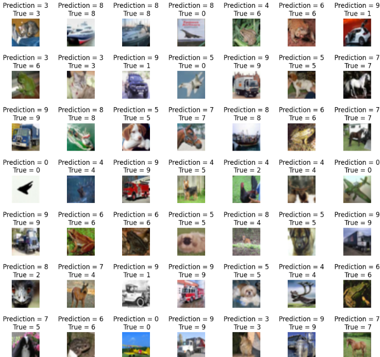
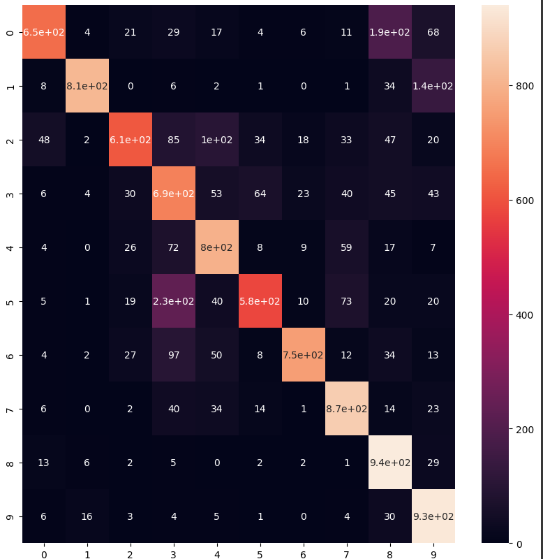

# 📊 CIFAR-10 Image Classification 🖼️

A deep learning project to classify images from the CIFAR-10 dataset using **Convolutional Neural Networks (CNNs)** with **TensorFlow/Keras**.  
This repository contains an end-to-end workflow: from data loading and augmentation, to training, evaluation, and insights.


---

## 📑 Table of Contents
- [🚀 Project Overview](#-project-overview)
- [⚙️ Setup](#-setup)
- [📥 Data](#-data)
- [🏗️ Model](#-model)
- [🔄 Data Augmentation](#-data-augmentation)
- [🚀 Training](#-training)
- [📈 Results](#-results)
- [✅ Conclusion](#-conclusion)
- [🤝 Contributing](#-contributing)
- [📄 License](#-license)

---

## 🚀 Project Overview
CIFAR-10 is a dataset of **60,000 32×32 color images** across **10 classes**: 

    0. Airplanes
    1. Cars
    2. Birds
    3. Cats
    4. Deer
    5. Dogs
    6. Frogs
    7. Horses
    8. Ships
    9. Trucks
This project builds and trains a CNN model to classify these images, demonstrating fundamental deep learning principles in computer vision.

---

## ⚙️ Setup

### 🔧 Requirements
- Python 3.7+
- TensorFlow 2.x
- NumPy
- Matplotlib
- Seaborn
- Scikit-Learn
- Jupyter Notebook / Google Colab

### 🧰 Install dependencies:
```bash
pip install tensorflow numpy matplotlib
```

### 📂 Clone this repo:
```bash
git clone https://github.com/your-username/cifar10-classification.git
cd cifar10-classification
```

---

## 📥 Data
The CIFAR-10 dataset is automatically downloaded from `keras.datasets`.  
It consists of:
- 50,000 training images
- 10,000 test images
- 10 categories: airplane, automobile, bird, cat, deer, dog, frog, horse, ship, truck

---

## 🏗️ Model
The CNN model consists of:
- 2–3 Convolutional layers + MaxPooling
- Dropout for regularization
- Fully connected Dense layers
- Softmax output layer for 10 classes

---

## 🔄 Data Augmentation
To improve generalization and reduce overfitting, data augmentation is applied:
- 🔄 Horizontal flips
- 🔄 Random rotations
- 🔄 Shifts and zoom

Implemented using `ImageDataGenerator`.

---

## 🚀 Training
The model is trained for a configurable number of epochs, and validated on the test set.  
Training and validation accuracy/loss curves are plotted for insights.

---

## 📈 Results
📊 **Test Accuracy:** ~78%  
📊 **Confusion Matrix:** 




---

## ✅ Conclusion
- The CNN effectively learns to classify CIFAR-10 images.
- Future enhancements:
  - Use of deeper architectures (ResNet, DenseNet)
  - Hyperparameter tuning
  - Advanced regularization and normalization techniques

---

💡 **Explore more:** [Keras CIFAR-10 documentation](https://keras.io/api/datasets/cifar10/)

---

### ⭐ *If you find this repository useful, please star it and share!* 🌟

